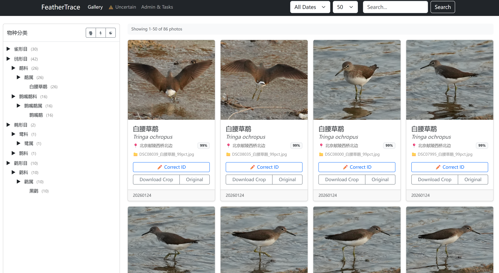

# WingScribe (飞羽志) - 智能鸟类摄影管理系统

**版本:** 2.0.0
**状态:** 新版发布 (云端识别 + 分离部署支持)

WingScribe 是一个专为鸟类摄影师打造的自动化管理流水线。它利用计算机视觉 (YOLOv8) 和多模态大模型 (BioCLIP) 技术，自动完成照片的**检测、筛选、物种识别、元数据注入**以及**层级归档**，并提供一个支持人工校对的本地 Web 界面。

本项目是我个人的第一个从零开始完全使用Vibe Coding的项目，使用了Gemini CLI 、Claude Code with MiniMax2.1/GLM4.7，作为一个观鸟爱好者，图片库的识别和整理一直是我的一大痛点，这个项目也算是圆了几年前的一个小梦想。

本项目支持**本地 GPU/CPU 识别**和**云平台 API 识别**两种模式，支持分离部署架构。

[查看更新日志](docs/CHANGELOG_v1.6_zh.md) | [架构文档](docs/ARCHITECTURE.md) | [云端识别方案](docs/云端识别与分离部署方案.md)

---

## ✨ 核心功能

* **📂 智能导入与解析**:
  * **智能扫描**: 递归扫描文件夹，支持按日期范围过滤，极大提升处理效率。
  * **混合解析**: 支持标准的父目录格式 (`yyyyMMdd-...`) 和基于正则的子目录解析。
* **🧠 多引擎识别**:
  * **本地引擎**: BioCLIP v1/v2 (支持 GPU/CPU)
  * **云平台**: HuggingFace, 魔搭 (ModelScope), 懂鸟 (Dongniao), 阿里云, 百度智能云
  * **Top-K 候选**: 自动保存 AI 的前 5 个预测结果供人工复核。
  * **智能建议**: Web 界面提供"AI 备选"下拉菜单，一键修正物种。
* **📦 批量识别 API**:
  * **REST API**: 提供标准化的批量识别接口
  * **异步处理**: 支持大批量图片的异步识别
  * **Webhook 回调**: 任务完成后自动回调通知
* **🛠️ 动态归档**:
  * **自动整理**: 当您修正物种名时，系统会自动重命名文件并将其移动到正确的分类文件夹中。
  * **元数据**: 自动写入标准化的 EXIF/IPTC 数据（标题、关键词）。
* **🌐 网络存储支持**:
  * 通过操作系统挂载，完美支持 NAS (WebDAV/SMB) 路径。
* **💻 高级 Web 界面**:
  * **批处理**: 异步触发指定日期范围的处理任务。
  * **对比预览**: 实时切换"裁切细节图"与"原始环境图"。
  * **分类树筛选**: 交互式物种分类导航，动态翻页保持一致体验。
  * **等宽网格**: CSS Grid 布局确保照片始终等宽显示，无论每行数量多少。

---

## 📸 Web 界面预览



*支持物种分类筛选、动态翻页和原图对比功能。*

---

## 🛠️ 环境要求

* **操作系统**: Windows 10/11, macOS, 或 Linux。
* **Python**: 3.10 或更高版本。
* **GPU (可选)**: 推荐使用 NVIDIA RTX 系列显卡以加速本地 BioCLIP 推理（需要 CUDA 12.1+）。

---

## 🚀 部署指南

### ⚡ 一行命令快速部署

#### Windows 用户

```powershell
# 国内用户（Gitee，无需梯子）：
Invoke-WebRequest -Uri "https://gitee.com/jiangyuyi/wingscribe/raw/master/scripts/deploy.ps1" -OutFile deploy.ps1; Set-ExecutionPolicy -ExecutionPolicy RemoteSigned -Scope CurrentUser -Force; .\deploy.ps1

# 海外用户：
Invoke-WebRequest -Uri "https://raw.githubusercontent.com/jiangyuyi/wingscribe/master/scripts/deploy.ps1" -OutFile deploy.ps1; Set-ExecutionPolicy -ExecutionPolicy RemoteSigned -Scope CurrentUser -Force; .\deploy.ps1
```

> **说明**: Windows 默认禁止运行 PowerShell 脚本。上述命令会自动设置执行策略并运行一键部署。

#### Linux / macOS / WSL 用户

```bash
# 国内用户（Gitee，无需梯子）：
curl -fsSL https://gitee.com/jiangyuyi/wingscribe/raw/master/scripts/deploy.sh -o deploy.sh && bash deploy.sh deploy

# 海外用户：
curl -fsSL https://raw.githubusercontent.com/jiangyuyi/wingscribe/master/scripts/deploy.sh -o deploy.sh && bash deploy.sh deploy
```

> **说明**: Gitee 为国内镜像站，下载速度更快且无需翻墙工具；GitHub 为官方仓库，版本更新更及时。

#### 可用命令

| 命令 | 说明 |
|------|------|
| `deploy` | 完整部署流程 (推荐) |
| `install` | 仅安装依赖 |
| `config` | 运行配置向导 |
| `update` | 更新项目 |
| `cuda` | 安装 CUDA (GPU 支持) |
| `web` | 启动 Web 服务 |
| `docker:local` | Docker 本地部署 |
| `docker:cpu` | Docker CPU 识别服务 |
| `docker:gpu` | Docker GPU 识别服务 |
| `docker:all` | Docker 完整分离部署 |
| `cloud:config` | 配置云平台 API |
| `cloud:list` | 列出可用云平台 |
| `help` | 显示帮助 |

#### 部署流程

脚本会自动执行以下步骤：

| 步骤 | 操作 | 说明 |
|------|------|------|
| 1 | 环境检测 | 检测 Python、Git、ExifTool、GPU |
| 2 | 自动安装 | 缺失的软件通过包管理器自动安装 |
| 3 | 切换镜像 | pip 和 HuggingFace 切换到国内源 |
| 4 | 克隆项目 | 从 Gitee 镜像克隆 (国内用户友好) |
| 5 | 安装依赖 | 创建虚拟环境并安装 Python 包 |
| 6 | 配置向导 | 交互式设置照片源目录、输出目录等 |
| 7 | 生成配置 | 自动生成 `settings.yaml` 和 `secrets.yaml` |

#### 交互式界面预览

```
┌────────────────────────────────────────┐
│     🪶 飞羽志 WingScribe 一键部署       │
├────────────────────────────────────────┤
│  [1] 🚀 开始部署                        │
│  [2] ⚙️  配置选项                       │
│  [3] 📦 更新项目                        │
│  [4] ⬇️  下载模型                       │
│  [5] ▶️  启动服务                       │
│  [6] 📖 查看帮助                       │
│  [7] ❌  退出                           │
└────────────────────────────────────────┘
```

#### GitHub 国内访问

脚本默认从 **Gitee 镜像** 克隆（https://gitee.com/jiangyuyi/wingscribe），确保国内用户可以快速下载。

---

### 🐳 Docker 部署

WingScribe 支持 Docker 容器化部署，提供 CPU 和 GPU 两个版本。

#### Docker 一键启动

```bash
# 本地一体化部署
bash scripts/deploy.sh docker:local

# 仅启动 CPU 识别服务
bash scripts/deploy.sh docker:cpu

# 仅启动 GPU 识别服务（需要 NVIDIA Docker）
bash scripts/deploy.sh docker:gpu

# 完整分离部署（Web + CPU + GPU + Redis）
bash scripts/deploy.sh docker:all
```

#### Docker Compose 配置

**本地一体化部署 (docker-compose.yml):**
```yaml
services:
  wingscribe:
    build: .
    ports:
      - "8000:8000"
```

**分离部署 (docker-compose.remote.yml):**
```yaml
services:
  # CPU 识别服务
  recognition-cpu:
    build:
      dockerfile: Dockerfile.cpu
    ports:
      - "8080:8000"

  # GPU 识别服务
  recognition-gpu:
    build:
      dockerfile: Dockerfile.gpu
    ports:
      - "8081:8000"
    deploy:
      resources:
        reservations:
          devices:
            - driver: nvidia
              count: 1
              capabilities: [gpu]

  # 消息队列（大批量任务）
  redis:
    image: redis:7-alpine
    ports:
      - "6379:6379"
```

#### Docker 镜像说明

| 镜像 | Dockerfile | 说明 |
|------|-----------|------|
| CPU 版 | `Dockerfile.cpu` | 无 GPU 环境使用，资源占用约 4GB |
| GPU 版 | `Dockerfile.gpu` | 需要 NVIDIA Docker，支持 CUDA 加速 |

---

### ☁️ 云平台配置

WingScribe 支持多种云平台识别服务，无需本地 GPU 即可获得高质量识别结果。

#### 支持的云平台

| 平台 | 说明 | 获取方式 |
|------|------|---------|
| **HuggingFace** | BioCLIP 等开源模型 | [获取 Token](https://huggingface.co/settings/tokens) |
| **魔搭 (ModelScope)** | 国内镜像，鸟类分类模型 | [获取 Token](https://modelscope.cn/my/settings/token) |
| **懂鸟 (Dongniao)** | 国内专业鸟类识别 API | [申请 Access Key](https://ai.open.hhodata.com/) |
| **阿里云** | 图像标签识别服务 | [控制台](https://ram.console.aliyun.com/) |
| **百度智能云** | 图像识别 API | [控制台](https://ai.baidu.com/) |

#### 配置方法

```bash
# 交互式配置云平台 API Keys
bash scripts/deploy.sh cloud:config

# 列出已配置的平台
bash scripts/deploy.sh cloud:list
```

#### 环境变量配置

```bash
# HuggingFace
export HF_TOKEN="your_huggingface_token"

# 魔搭
export MODELSCOPE_TOKEN="your_modelscope_token"

# 懂鸟
export DONGNIAO_API_KEY="your_dongniao_api_key"

# 阿里云
export ALIYUN_ACCESS_KEY_ID="your_access_key_id"
export ALIYUN_ACCESS_KEY_SECRET="your_access_key_secret"

# 百度云
export BAIDU_API_KEY="your_api_key"
export BAIDU_SECRET_KEY="your_secret_key"
```

#### API 调用示例

```bash
# 单张识别
curl -X POST http://localhost:8000/api/recognition/recognize \
  -H "Content-Type: application/json" \
  -d '{"image_path": "/path/to/bird.jpg", "platform": "huggingface", "top_k": 5}'

# 批量识别
curl -X POST http://localhost:8000/api/recognition/batch \
  -H "Content-Type: application/json" \
  -d '{
    "images": [
      {"image_path": "/path/to/bird1.jpg", "platform": "huggingface"},
      {"image_path": "/path/to/bird2.jpg", "platform": "local"}
    ],
    "webhook_url": "https://your-callback.com/notify"
  }'
```

---

### 🔧 分离部署架构

对于大规模部署场景，WingScribe 支持将 Web 服务和识别服务分离部署：

```
┌─────────────────────────────────────────────────────┐
│                    本地 WingScribe                  │
│  ┌─────────────┐  ┌────────────────────────────┐   │
│  │  Web UI     │  │  Pipeline                  │   │
│  │  :8000      │  │  YOLO Detection            │   │
│  └─────────────┘  └────────────┬───────────────┘   │
│                               │                     │
│                      ┌────────▼────────┐           │
│                      │  Batch API      │           │
│                      │  /api/recognize │           │
│                      └────────┬────────┘           │
│                               │                     │
└───────────────────────────────┼─────────────────────┘
                                │ HTTP
                                ▼
                    ┌─────────────────────┐
                    │  识别服务集群        │
                    ├─────────────────────┤
                    │ recognition-cpu:8080│
                    │ recognition-gpu:8081│
                    │ redis:6379          │
                    └─────────────────────┘
```

#### 启动分离部署

```bash
# 1. 启动识别服务
docker compose -f docker-compose.remote.yml up -d recognition-cpu

# 2. 配置 Web 服务指向识别服务
# 编辑 config/settings.yaml
# recognition:
#   mode: "api"
#   api_endpoint: "http://localhost:8080"

# 3. 启动 Web 服务
python src/web/app.py
```

---

### 1. 安装依赖

#### 步骤 A: 安装 ExifTool (必须)

ExifTool 用于写入照片元数据，必须单独安装。

**Windows:**

```bash
# 方法1: 使用 Chocolatey (推荐)
chocolatey install exiftool

# 方法2: 手动安装
# 1. 下载: https://exiftool.org/install.html#Win32
# 2. 解压后将 exiftool(-a).exe 重命名为 exiftool.exe
# 3. 放入系统 PATH (如 C:\Windows\) 或自定义目录
```

**macOS:**

```bash
# 使用 Homebrew
brew install exiftool
```

**Linux:**

```bash
# Debian/Ubuntu
sudo apt install libimage-exiftool-perl

# 或从源码编译
```

> **重要**: 确保在终端运行 `exiftool -ver` 能正常显示版本号。

#### 步骤 B: 克隆代码并安装 Python 依赖

```bash
# 1. 克隆代码
git clone https://github.com/your-repo/feather_trace.git
cd feather_trace

# 2. 创建虚拟环境 (推荐)
python -m venv venv
# Windows:
.\venv\Scripts\activate
# Linux/macOS:
source venv/bin/activate

# 3. 安装 Python 依赖
pip install -r requirements.txt
```

#### 步骤 C: 预下载 BioCLIP 模型 (可选，推荐)

首次使用本地识别时，系统会自动下载 BioCLIP 模型（约 300MB）。如需预下载：

```bash
# 使用模型下载脚本
python scripts/download_model.py

# 或手动下载
# BioCLIP v2 (推荐): hf.co/imageomics/bioclip-v2
# BioCLIP v1: hf.co/imageomics/bioclip
```

> 模型默认缓存至 `~/.cache/huggingface/hub/`。

---

### 2. 配置

WingScribe 使用 YAML 进行配置。

1. **主设置**: 编辑 `config/settings.yaml` 来定义您的照片源路径和输出结构。
2. **密钥**: 如果使用云端 API，请编辑 `config/secrets.yaml` 填入您的 API Key：

   ```bash
   # 创建密钥配置文件
   bash scripts/deploy.sh cloud:config

   # 或手动创建
   cat > config/secrets.yaml << EOF
   cloud:
     huggingface:
       api_token: ${HF_TOKEN}
     modelscope:
       api_token: ${MODELSCOPE_TOKEN}
     dongniao:
       api_key: ${DONGNIAO_API_KEY}
     aliyun:
       access_key_id: ${ALIYUN_ACCESS_KEY_ID}
       access_key_secret: ${ALIYUN_ACCESS_KEY_SECRET}
     baidu:
       api_key: ${BAIDU_API_KEY}
       secret_key: ${BAIDU_SECRET_KEY}
   EOF
   ```

3. **API 认证 (可选)**: 如需对外提供 API 服务，可启用认证：

   ```yaml
   # config/settings.yaml
   api:
     enabled: true
     rate_limit: 1000/day
     quota: 10000/month
   ```

   使用时在请求头中添加 `X-API-Key`：

   ```bash
   curl -X POST http://localhost:8000/api/recognition/recognize \
     -H "X-API-Key: your_api_key" \
     -H "Content-Type: application/json" \
     -d '{"image_path": "/path/to/bird.jpg", "platform": "local"}'
   ```

👉 **[阅读完整配置指南](docs/CONFIGURATION.md)** 了解所有可用选项。

---

### 3. NAS / 远程存储

要处理存储在 NAS (群晖, 威联通等) 上的照片，您必须先将网络共享挂载为本地驱动器。

👉 **[阅读 NAS 设置指南](docs/NAS_SETUP_zh.md)**。

---

### 4. 启动系统

#### A. 启动 Web 界面 (推荐)

这将启动本地 Web 服务器，用于浏览、编辑和触发批处理任务。

```bash
python src/web/app.py
```

* 访问地址: `http://localhost:8000`
* **提示**: 进入 "Admin (管理)" 页面来触发您的第一次扫描。

**首次启动检查清单:**

- [ ] `exiftool` 命令可正常执行
- [ ] `config/settings.yaml` 中的路径已正确配置
- [ ] `allowed_roots` 包含所有需要访问的盘符
- [ ] 照片源目录中有符合命名格式的文件夹 (`YYYYMMDD_地点`)

#### B. 命令行接口 (高级)

您也可以不通过 Web 界面直接运行流水线。

```bash
# 运行流水线，处理指定日期范围的照片
python src/pipeline_runner.py --start 20240101 --end 20240131
```

#### C. 独立识别服务 (API Server)

如需仅运行识别 API 服务（供其他系统调用）：

```bash
# 启动独立识别服务
python src/recognition_service.py

# 服务将在 http://localhost:8000 提供 REST API
# API 文档: http://localhost:8000/docs
```

---

### 5. 常见问题

**Q: 启动报错 "exiftool not found"**
A: 确保 ExifTool 已安装并添加到系统 PATH。重启终端后再试。

**Q: 本地 BioCLIP 识别首次运行很慢**
A: 首次运行时需要下载模型（约 300MB），后续会缓存使用。

**Q: CUDA out of memory**
A: 在 `settings.yaml` 中将 `device` 改为 `cpu`，或减小 `local.inference_batch_size`。

**Q: Windows 中文路径乱码**
A: 确保系统区域设置支持 UTF-8，或使用英文路径。

**Q: 如何选择使用本地识别还是云平台识别？**
A: 根据需求选择：
- **本地 BioCLIP**: 免费、隐私保护好、无需网络，适合日常使用
- **云平台**: 无需 GPU 硬件、模型更新及时、适合批量处理

**Q: 云平台识别的费用是多少？**
A: 各平台定价不同：
- HuggingFace: 免费额度有限，超出后按调用计费
- 魔搭社区: 提供免费额度
- 阿里云/百度云: 按调用次数计费，价格较低

**Q: 批量识别 API 如何使用？**
A: 批量识别支持异步处理：
```python
import requests

# 创建批量任务
response = requests.post("http://localhost:8000/api/recognition/batch", json={
    "images": [
        {"image_path": "/path/to/bird1.jpg", "platform": "local"},
        {"image_path": "/path/to/bird2.jpg", "platform": "huggingface"}
    ],
    "webhook_url": "https://your-callback.com/notify"
})
batch_id = response.json()["batch_id"]

# 查询进度
while True:
    status = requests.get(f"http://localhost:8000/api/recognition/batch/{batch_id}")
    if status.json()["status"] == "completed":
        break
```

---

## 🤝 致谢

* **IOC World Bird List**: [https://www.worldbirdnames.org/](https://www.worldbirdnames.org/) (分类学标准)
* **BioCLIP**: [https://imageomics.github.io/bioclip/](https://imageomics.github.io/bioclip/) (视觉模型)
* **懂鸟**: [https://ai.open.hhodata.com/](https://ai.open.hhodata.com/) (中国鸟类识别 API)
* **HuggingFace**: [https://huggingface.co/](https://huggingface.co/) (云端推理 API)
* **魔搭社区**: [https://modelscope.cn/](https://modelscope.cn/) (国内模型服务)
* **阿里云**: [https://www.aliyun.com/](https://www.aliyun.com/) (图像识别服务)
* **百度智能云**: [https://ai.baidu.com/](https://ai.baidu.com/) (图像识别服务)

---

**许可证**: MIT
**作者**: 鱼酱 (with Gemini Assistant)
